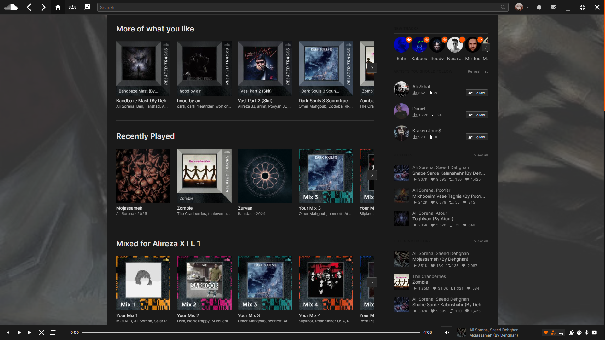

# BetterSoundCloud | [](https://github.com/AlirezaKJ/BetterSoundCloud/releases) <a href="https://www.buymeacoffee.com/alirezakj" target="_blank"></a> [](https://www.jsdelivr.com/package/gh/AlirezaKJ/BetterSoundCloud)

A PC client of SoundCloud with themes and plugins made using electronjs



# Installation
## Auto Installers for Windows | Portable
[](https://github.com/AlirezaKJ/BetterSoundCloud/releases/download/V0.6.0/BetterSoundCloud.0.6.0.Portable.zip)
[](https://github.com/AlirezaKJ/BetterSoundCloud/releases/download/V0.6.0/BetterSoundCloud.0.6.0.msi)
[](https://github.com/AlirezaKJ/BetterSoundCloud/archive/refs/tags/V0.6.0.zip)

### 🐧 Linux Auto Installer

Install **BetterSoundCloud** on Linux with one simple command.  
The installer will:

- Install **BetterSoundCloud** automatically in your home directory 
- Clone or update the repository  
- Install project dependencies  
- Create a `.desktop` launcher entry  

**Supported package managers:**

- `apt` — Debian, Ubuntu, and derivatives  
- `pacman` — Arch, Manjaro, and derivatives  
- `dnf` — Fedora, CentOS, RHEL  
- `zypper` — openSUSE  

💻 **One-line install command:**
```bash
bash <(curl -fsSL https://raw.githubusercontent.com/ULTRA-VAGUE/BetterSoundCloud-On-Linux/main/install_bettersoundcloud.sh)
```

## Manual Installation

### Prerequisites

- [Git](https://git-scm.com)
- [Node.js](https://nodejs.org/en/) (with [npm](https://www.npmjs.com/)).
- Command line of your choice.

### 1: Clone the repository

```ps
git clone https://github.com/AlirezaKJ/BetterSoundCloud
```

### 2: Move To Project Directory

```ps
cd "BetterSoundCloud"
```

### 3: Install dependencies

```ps
npm i
```

### 4: Run The App

```ps
npm start
```

## Features TODO List

- [ ] LastFM tracking
- [ ] Linux and Mac packages
- [ ] Proxy integration
- [ ] load url using deep links
- [ ] customize user agent string
- [ ] listen offline integration
- [ ] by pass this song is not available in your country
- [ ] enhance soundcloud shuffle method
- [ ] use soundcloud waveforms in fullscreen mode
- [X] DiscordRPC not working when starting Discord after BSC
- [x] Custom css editor
- [x] Custom js editor
- [x] Themes made by several developers
- [x] Full adblocker
- [x] Soundcloud downloader
- [x] lyrics integration using LRCLIB api
- [x] DiscordRPC integration

## FAQ

how to open the settings menu?

> either by opening the right click menu or using the bottom right icons.

is this app virus free?

> yes, bettersoundcloud has been verified as 100% clean by [Softpedia](https://www.softpedia.com/get/Multimedia/Audio/Audio-Players/BetterSoundCloud.shtml#status).

does my soundcloud account get banned for using bettersoundcloud?

> no, since we launched bettersoundcloud no one has been banned for using this client.

how can i report a bug or a feature idea?

> you can open a request at the repository issue page and i reach you under 24hours.
